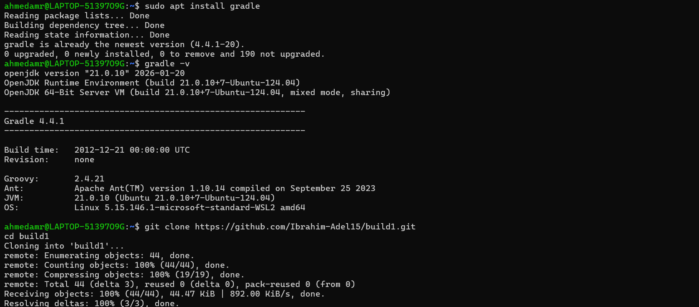
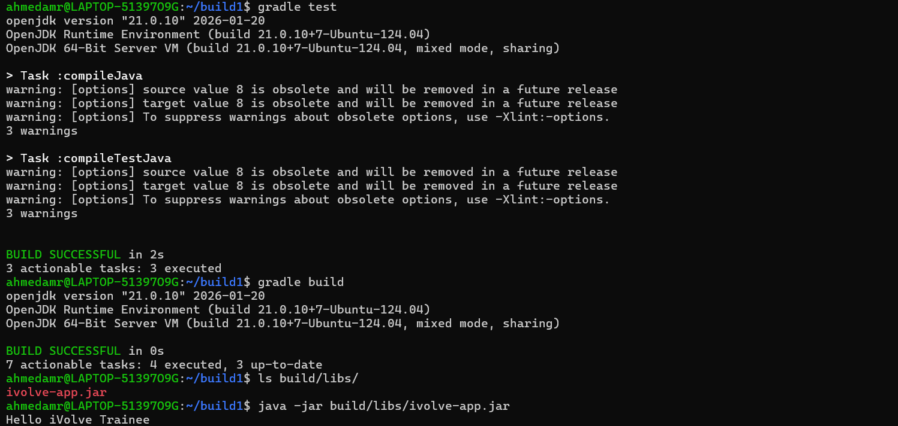

# Lab 1: Building and Packaging Java Applications with Gradle ⚙️☕

---

## 📌 Objectives

- Install Gradle
- Clone the source code repository
- Run unit tests
- Build the application and generate JAR artifact
- Run the application
- Verify the application is working

---

## 📥 Clone Repository

```bash
git clone https://github.com/Ibrahim-Adel15/build1.git
cd build1
```
## ⚙️ Install Gradle
```
sudo apt update
sudo apt install gradle -y
```
## Verify installation:
```
gradle -v
```

## 🧪 Run Unit Tests
```
gradle test
```
## 🏗️ Build Application
```
gradle build
```
## 📦Artifact location:
```
build/libs/ivolve-app.jar
```
## 🚀 Run Application
```
java -jar build/libs/ivolve-app.jar
```
