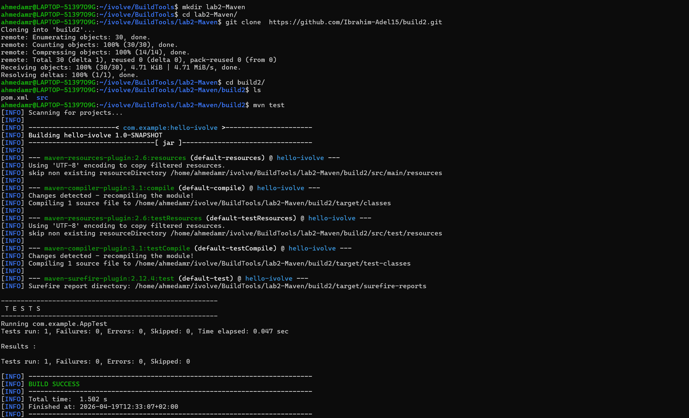
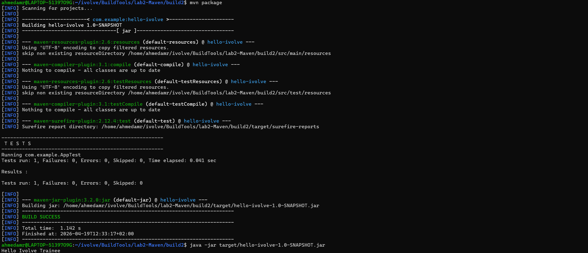

# Lab 2: Building and Packaging Java Applications with Maven ⚙️☕

---

## 📌 Objectives

- Install Maven
- Clone the source code repository
- Run unit tests
- Build the application and generate JAR artifact
- Run the application
- Verify the application is working

---

## 📥 Clone Repository

```bash
git clone https://github.com/Ibrahim-Adel15/build2.git
cd build2
```
## ⚙️ Install Maven
Ubuntu:
```bash
sudo apt update
sudo apt install maven -y
```

## Verify installation:
```bash
mvn -v
```
## 🧪Run Unit Tests
```bash
mvn test
```


## 🏗️Build Application
```bash
mvn clean package
```

## 📦Generated artifact location:
```bash
target/hello-ivolve-1.0-SNAPSHOT.jar
```
## 🚀Run Application
```bash
java -jar target/hello-ivolve-1.0-SNAPSHOT.jar
```

