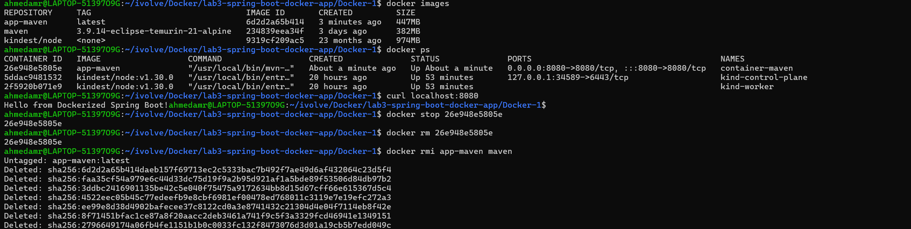

# Lab 3: Run Java Spring Boot App in a Container 🐳☕

---

## 📌 Objectives

- Clone Spring Boot application source code
- Write Dockerfile
- Build Docker image
- Run container
- Test application
- Stop and remove container

---

## 📥 Clone Repository

```bash id="d1"
git clone https://github.com/Ibrahim-Adel15/Docker-1.git
cd Docker-1
```
## 🐳 Create Dockerfile
```bash
FROM maven:3.9.14-eclipse-temurin-21-alpine
 
WORKDIR /app 

COPY . .

RUN mvn clean package 

#EXPOSE 8080

CMD ["java", "-jar", "target/demo-0.0.1-SNAPSHOT.jar"]
```

## 🏗️Build Docker Image
```bash
docker build -t app-maven .
```

## 🚀Run Container
```bash
docker run -d -p 8080:8080 --name container-maven app-maven
```
## 🌐Test Application
```bash
curl http://localhost:8080
```
## ⛔Stop Container
```bash
docker stop container-maven
```
## 🗑️Remove Container
```bash
docker stop container-maven
```
