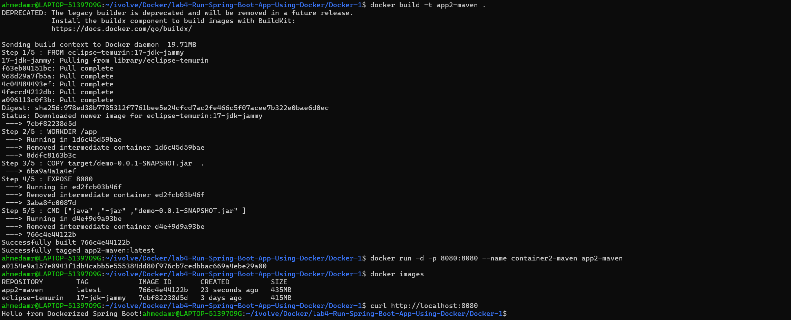
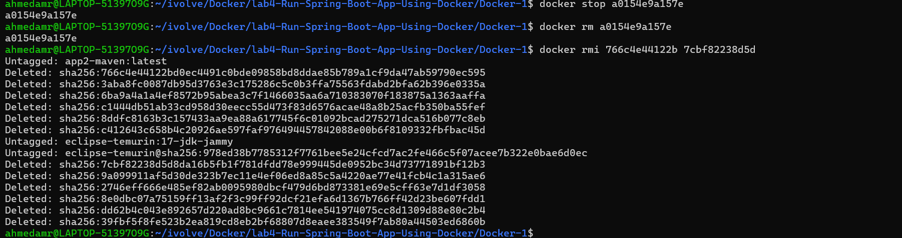

# Lab 4: Run Java Spring Boot App in a Container (Optimized Image) 🐳☕

---

## 📌 Objectives

- Clone the application source code
- Build the application using Maven
- Create optimized Dockerfile (JAR-based)
- Build Docker image (app2)
- Run container
- Test application
- Stop and remove container

---

## 📥 Clone Repository

```bash id="l4c1"
git clone https://github.com/Ibrahim-Adel15/Docker-1.git
cd Docker-1
```

## 🐳Create Dockerfile
```bash
FROM eclipse-temurin:17-jdk-jammy

WORKDIR /app 

COPY target/demo-0.0.1-SNAPSHOT.jar  .

EXPOSE 8080 

CMD ["java" ,"-jar" ,"demo-0.0.1-SNAPSHOT.jar" ]
```

## 🏗️Build Docker Image
```bash
docker build -t app2-maven .
```

## 🚀Run Container
```bash
docker run -d -p 8080:8080 --name container2-maven app2-maven
```
## 🌐Test Application
```bash
curl http://localhost:8080
```



## ⛔Stop Container
```bash
docker stop container2-maven
```
## 🗑️Remove Container
```bash
docker rm container2-maven
```

