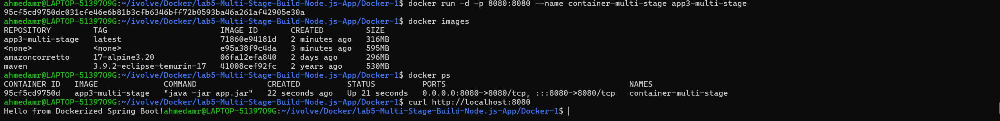

# Lab 5: Multi-Stage Build for Java Spring Boot App 🐳⚙️

---

## 📌 Objectives

- Clone application source code
- Write Multi-Stage Dockerfile
- Build application inside Docker (Stage 1)
- Run application using lightweight image (Stage 2)
- Build Docker image (app3)
- Run container
- Test application
- Stop and remove container

---

## 📥 Clone Repository

```bash id="l5c1"
git clone https://github.com/Ibrahim-Adel15/Docker-1.git
cd Docker-1
```

## 🐳Multi-Stage Dockerfile
```bash
FROM maven:3.9.2-eclipse-temurin-17 AS build

WORKDIR /app 

COPY . .

RUN mvn package  
 


FROM amazoncorretto:17-alpine3.20

WORKDIR /app

COPY --from=build /app/target/*.jar app.jar

ENTRYPOINT ["java", "-jar", "app.jar" ]
```

## 🏗️ Build Docker Image
```bash
docker build -t app3-multi-stage  .
```
## 📌Check image size:
```bash
docker images
```
## 🚀Run Container
```bash
docker run -d -p 8080:8080 --name container3-multi-stage app3-multi-stage  .
```

## 🌐Test Application
```bash
curl http://localhost:8080
```

## ⛔Stop Container
```bash
docker stop container3-multi-stage
```
## 🗑️Remove Container
```bash
docker rm container3-multi-stage
```

 