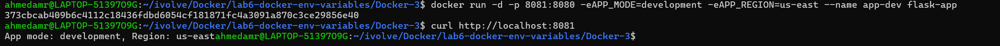
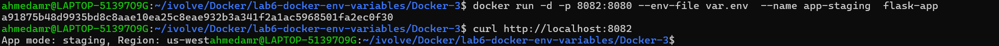
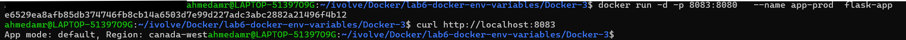
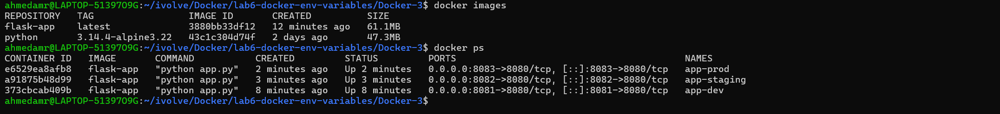
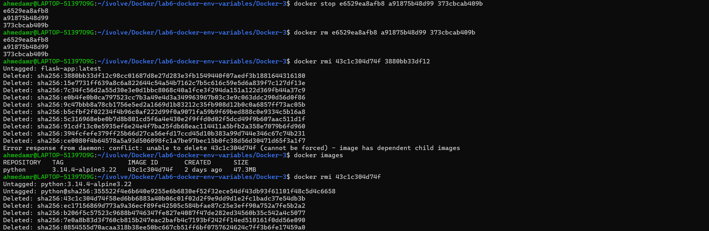

# Lab 6: Managing Docker Environment Variables Across Build and Runtime 🐳🐍

---

## 📌 Objectives

- Clone Python Flask application
- Write Dockerfile
- Build Docker image
- Run multiple containers with different environments
- Manage environment variables using 3 methods

---

## 📥 Clone Repository

```bash 
git clone https://github.com/Ibrahim-Adel15/Docker-3.git
cd Docker-3
```
## 🐳Create Dockerfile
```bash 

FROM python:3.14.4-alpine3.22

WORKDIR /app 

COPY . .

RUN pip install --no-cache-dir flask 

ENV APP_MOD=production 

ENV APP_REGION=canada-west

expose 8080

CMD [ "python", "app.py" ]


FROM python:3.14.4-alpine3.22

WORKDIR /app

COPY . .

RUN pip install --no-cache-dir flask

expose 8080

CMD [ "python", "app.py" ]
``` 

## 🏗️Build Docker Image
```bash 
docker build -t flask-app . 
```
## 🚀Run Containers with Different Environments

## 🔹 1. Using CLI Environment Variables
```bash 
docker run-d-p8081:8080 \
-eAPP_MODE=development \
-eAPP_REGION=us-east \
--name app-dev flask-app
``` 



## 🔹 2. Using Environment File

Create file env.list:
```bash 
APP_MODE=staging
APP_REGION=us-west
```
Run container:
```bash 
docker run -d -p 8082:8080 \
--env-file var.rnv \
--name app-stage flask-app
```


## 🔹 3. Using Dockerfile Defaults

```bash 
docker run -d -p 8083:8080 \
--name app-prod flask-app
```


## 🌐 Test Application

```bash 
curl http://localhost:8081
curl http://localhost:8082
curl http://localhost:8083
```



## ⛔ Stop Containers

```bash 
docker stop container-dev container-stage container-prod
```

## 🗑️ Remove Containers
```bash 
docker rm container-dev container-stage container-prod
```


