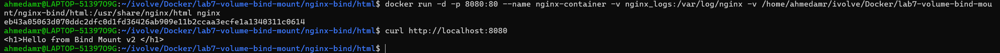
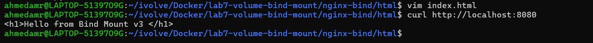
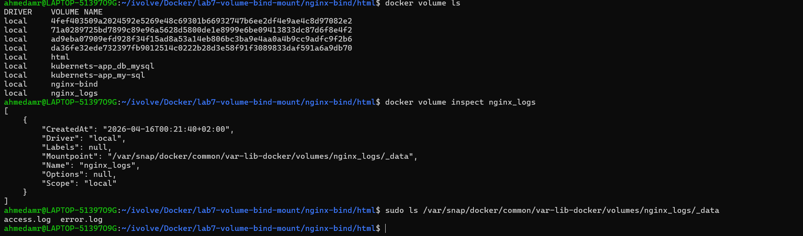
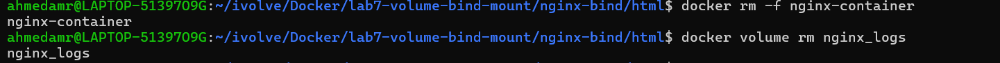

# Lab 7: Docker Volume and Bind Mount with Nginx 🌐🐳

---

## 📌 Objectives

- Create Docker volume for Nginx logs
- Create bind mount for custom HTML page
- Run Nginx container with volume + bind mount
- Verify web page using curl
- Modify content from host and verify changes
- Check persisted logs
- Remove Docker volume

---

## 📁 Create Docker Volume

```bash id="l7c1"
docker volume create nginx_logs
```
## Verify volume location:
```bash
docker volume inspect nginx_logs
```

Default path:
```bash
/var/lib/docker/volumes/nginx_logs
```
## 📁Create Bind Mount Directory
```bash
mkdir -p nginx-bind/html
```
## 📝 Create index.html
```bash
echo "Hello from Bind Mount" > nginx-bind/html/index.html
```

## 🐳 Run Nginx Container

```bash
docker run -d -p 8080:80 \
--name nginx-container \
-v nginx_logs:/var/log/nginx \
-v $(pwd)/nginx-bind/html:/usr/share/nginx/html \
nginx
```
## 🌐 Verify Nginx Page
```bash
curl http://localhost:8080
```
Expected output:
```bash
Hello from Bind Mount
```


## ✏️ Modify HTML File (Host Machine)
```bash
echo "Updated from Host Machine" > nginx-bind/html/index.html
```

Verify again:

```bash
curl http://localhost:8080
```


## 📊 Verify Logs in Volume
```bash
docker exec -it nginx-container bash
``` 
```bash 
ls /var/log/nginx
```

## ⛔ Stop Container
```bash
docker stop nginx-container
``` 

## 🗑️ Remove Container
```bash
docker volume rm nginx_logs
```



