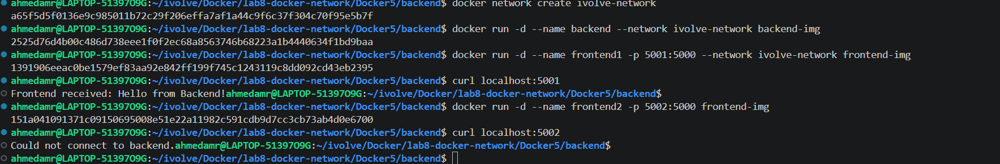
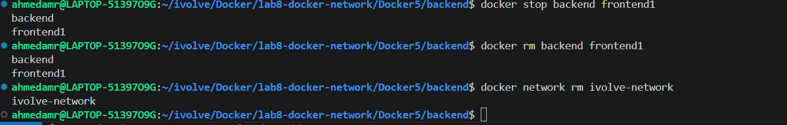

# Lab 8: Custom Docker Network for Microservices 🌐🐳

---

## 📌 Objectives

- Clone frontend & backend applications
- Build Docker images for both services
- Create custom Docker network
- Run containers inside custom network
- Test communication between services
- Compare with default Docker network
- Delete network

---

## 📥 Clone Repository

```bash id="l8c1"
git clone https://github.com/Ibrahim-Adel15/Docker5.git
cd Docker5
```
## 🐳 Create Dockerfile (Frontend)
```bash
FROM python:3.15.0a8-alpine3.23 

WORKDIR /app

COPY . .

RUN pip install -r  requirements.txt

EXPOSE 5000

CMD ["python", "app.py" ]
```
🏗️ Build Frontend Image
```bash
docker build -t frontend-img .
```

## 🐳 Create Dockerfile (Backend)
```bash
FROM python:3.15.0a8-alpine3.23

WORKDIR /app

COPY . .

RUN pip install flask 

EXPOSE 5000

CMD ["python", "app.py" ]
```

## 🏗️ Build Backend Image
```bash
docker build -t backend-img .
```

🌐 Create Custom Network
```bash
docker network create ivolve-network
```

🚀 Run Containers on Custom Network
```bash
docker run -d \
--name backend \
--network ivolve-network \
backend-image
```
🔹 Run Frontend (frontend1 on custom network)
```bash
docker run -d \
--name frontend1 \
--network ivolve-network \
frontend-image
```

🔹 Run Frontend (frontend2 on default network)
```bash

docker run -d \
--name frontend2 \
frontend-image
```

## 🔍 Verify Communication
```bash

docker network inspect ivolve-network
```

Test communication from frontend1 → backend
```bash
docker exec -it frontend1 sh
```
```bash

curl http://backend:50003
```

⚠️ Test frontend2 (default network)
```bash
docker exec -it frontend2 sh
```
```bash
curl http://backend:5000
```

## 🧹 Remove Network
```bash
docker network rm ivolve-network
```

## ⛔ Stop & Remove Containers
```bash
docker stop backend frontend1 frontend2
docker rm backend frontend1 frontend2 
``` 


