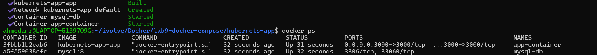
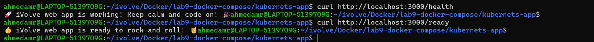
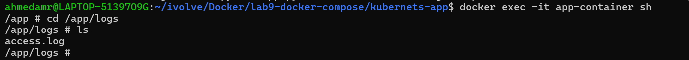
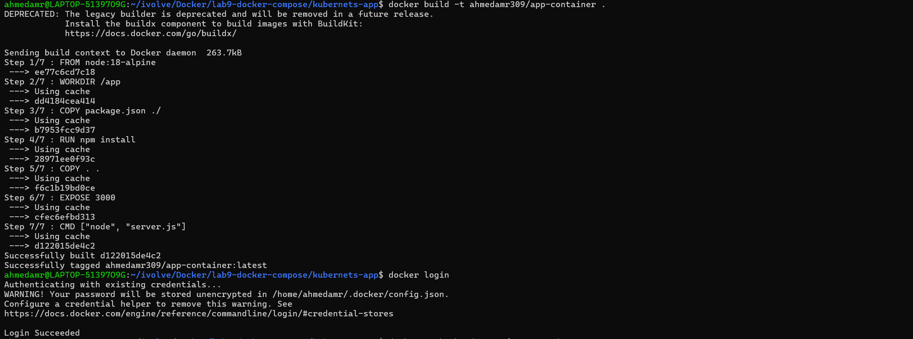
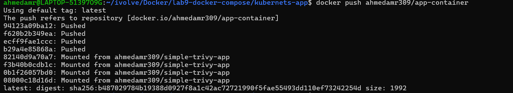
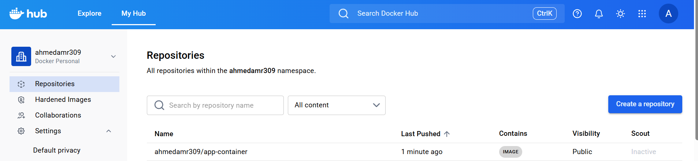

# Lab 9: Containerized Node.js and MySQL Stack Using Docker Compose 🐳🧩

---

## 📌 Objectives

- Clone Node.js application
- Configure MySQL database
- Create docker-compose.yml
- Connect app with database
- Verify health endpoints
- Check logs
- Push image to Docker Hub

---

## 📥 Clone Repository

```bash id="l9c1"
git clone https://github.com/Ibrahim-Adel15/kubernets-app.git
cd kubernets-app
```

## 🐳 Docker Compose Configuration
create:
```bash
version: "3.8"

volumes:
       db_mysql: 

services: 
       app: 
            build: .
            container_name: app-container 
            environment:
                DB_HOST: db
                DB_USER: user0
                DB_PASSWORD: 12345
            ports: 
                 - "3000:3000"
            depends_on:
                 - db

       db:
            image: mysql:8 
            container_name: mysql-db
            volumes:
                    - db_mysql:/var/lib/mysql  
            environment:  
                    MYSQL_ROOT_PASSWORD: pass123
                    MYSQL_DATABASE: ivolve
                    MYSQL_USER: user0
                    MYSQL_PASSWORD: 12345
```
## 🚀 Run Application
```bash
docker-compose up -d --build
```

## 🌐 Verify Application
```bash
curl http://localhost:3000
```
## 🔍 Health Checks
```bash
curl http://localhost:3000/health
curl http://localhost:3000/ready
```



## 📊 Check Logs
```bash
docker logs node-app
``` 

Inside container:
```bash
docker exec -it node-app sh
ls /app/logs/
``` 

## 🗄️ Verify Database
```bash
docker exec -it mysql-db mysql -u root -p
```


## 📦 Push Image to Docker Hub
```bash
docker login

docker tag node-app <your-dockerhub-username>/node-app:latest

docker push <your-dockerhub-username>/node-app:latest
``` 



## ⛔ Stop Services
```bash
docker-compose down
``` 


