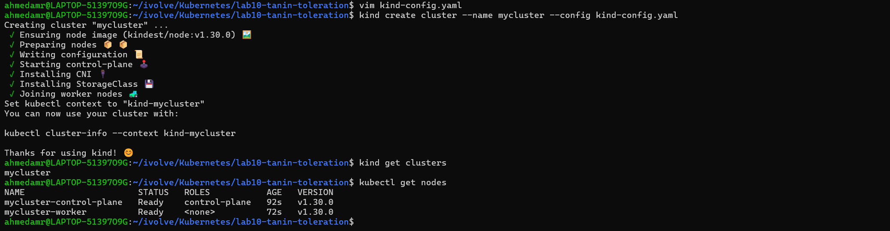
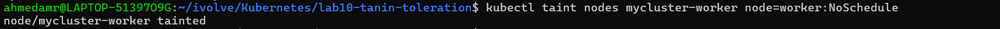
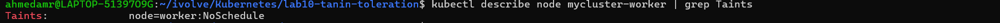
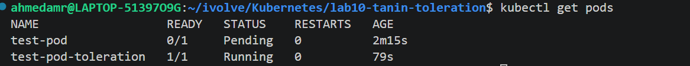
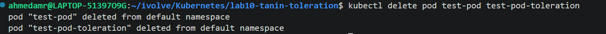

# 🚀 Lab 10: Node Isolation Using Taints in Kubernetes

## 📌 Overview

This lab demonstrates how to isolate workloads in Kubernetes using **taints**.
Taints allow you to control which pods can be scheduled on specific nodes.

---

## 🎯 Objectives

* Run a Kubernetes cluster with **2 nodes**
* Apply a **taint** on one node
* Prevent pods from being scheduled unless they tolerate the taint
* Verify the configuration

---

## 🧱 Prerequisites

* Kubernetes cluster (Minikube, Kubeadm, or Kind)
* `kubectl` installed and configured
* At least **2 nodes** in the cluster

---

## ⚙️ Step 1: Verify Cluster Nodes

Check available nodes:

```bash
kubectl get nodes
```

Expected output:

```
NAME                       STATUS   ROLES           AGE   VERSION
myclaster-control-plane    Ready    control-plane   XXm   v1.xx.x
myclaster-worker           Ready    <none>          XXm   v1.xx.x
```

---
---

## 🧪 Step 2: Apply Taint to Worker Node

Apply a taint to the worker node:

```bash
kubectl taint nodes myclaster-worker  node=worker:NoSchedule
```

🔹 Breakdown:

* `node=worker` → key=value
* `NoSchedule` → pods will not be scheduled unless they tolerate it

---

## 🔍 Step 3: Verify Taint

Describe the node:

```bash
kubectl describe node myclaster-worker 
```

Look for:

```
Taints: node=worker:NoSchedule
```

---

## 🧠 Step 4: Test Scheduling Behavior

### ❌ Without Toleration

Create a simple pod:

```yaml
apiVersion: v1
kind: Pod
metadata:
  name: test-pod
spec:
  containers:
  - name: nginx
    image: nginx
```

Apply it:

```bash
kubectl apply -f pod.yaml
```

Check status:

```bash
kubectl get pods
```

➡️ Pod should **NOT** be scheduled on the tainted node.

---

### ✅ With Toleration

Update pod spec:

```yaml
apiVersion: v1
kind: Pod
metadata:
  name: test-pod-toleration
spec:
  containers:
  - name: nginx
    image: nginx
  tolerations:
  - key: "node"
    operator: "Equal"
    value: "worker"
    effect: "NoSchedule"
```

Apply it:

```bash
kubectl apply -f pod-toleration.yaml
```

➡️ Pod **can now be scheduled** on the tainted node.

---

## 🧹 Cleanup

Remove taint:

```bash
kubectl taint nodes myclaster-worker node=worker:NoSchedule-
```

Delete test pods:

```bash
kubectl delete pod test-pod test-pod-toleration
```

---

## 📚 Key Concepts

| Concept    | Description                          |
| ---------- | ------------------------------------ |
| Taint      | Applied on nodes to repel pods       |
| Toleration | Applied on pods to allow scheduling  |
| NoSchedule | Prevents scheduling unless tolerated |

---

## 🏁 Conclusion

Taints and tolerations provide fine-grained control over pod placement in Kubernetes, enabling node isolation and workload segmentation.