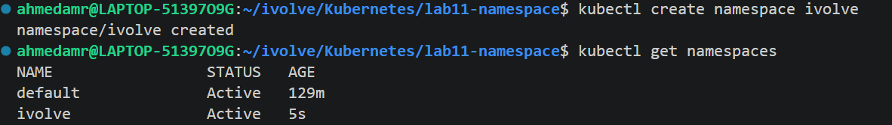
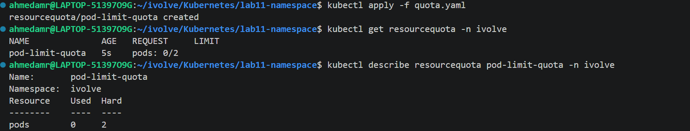
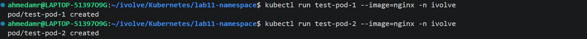
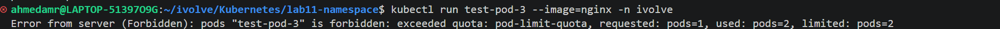

# 🚀 Lab 11: Namespace Management and Resource Quota Enforcement (Kubernetes)

## 📌 Overview
This lab demonstrates how to create a Kubernetes namespace and enforce resource limits using **ResourceQuota**.  
The goal is to restrict the number of pods that can be created inside a namespace.

---

## 🎯 Objectives
- Create a Kubernetes namespace called `ivolve`
- Apply a ResourceQuota to limit the number of pods to **2**
- Verify enforcement of the quota

---

## 🧱 Prerequisites
- Kubernetes cluster (Minikube / Kubeadm / Kind)
- `kubectl` configured and working
- Basic knowledge of Kubernetes concepts

---

## 📁 Step 1: Create Namespace

Create a namespace called `ivolve`:

```bash
kubectl create namespace ivolve
```
```bash
kubectl get namespaces
```

📁 Step 2: Create ResourceQuota
```bash
apiVersion: v1
kind: ResourceQuota
metadata:
  name: pod-limit-quota
  namespace: ivolve
spec:
  hard:
    pods: "2"
```
## 📁 Step 3: Apply ResourceQuota
```bash
kubectl apply -f quota.yaml
```
## 📁 Step 4: Verify ResourceQuota
```bash
kubectl get resourcequota -n ivolve
kubectl describe resourcequota pod-limit-quota -n ivolve
```

## 📁 Step 5: Test the Quota
```bash
kubectl run test-pod-1 --image=nginx -n ivolve
kubectl run test-pod-2 --image=nginx -n ivolve
```

```bash
kubectl run test-pod-3 --image=nginx -n ivolve
```

## 📊 Result
Namespace ivolve created successfully
Pod limit enforced: maximum 2 pods
Kubernetes prevents exceeding resource quota